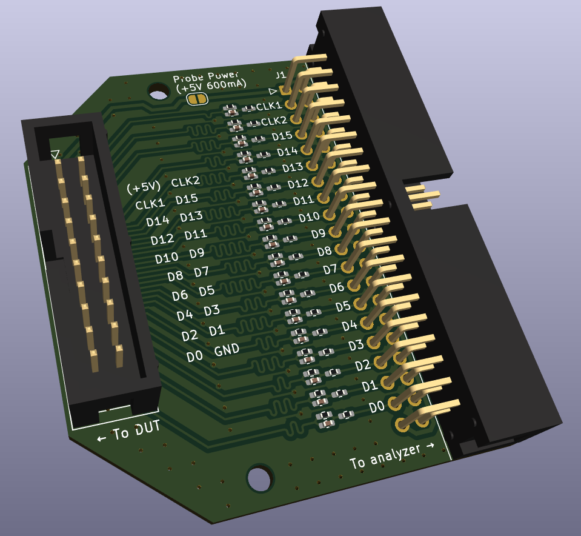
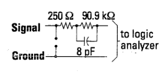
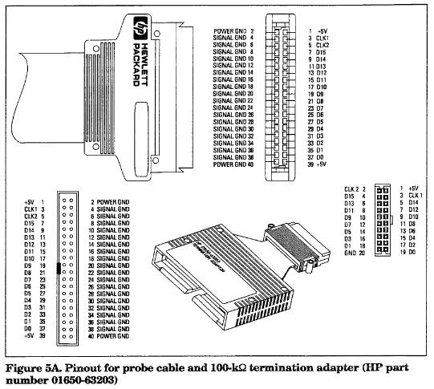
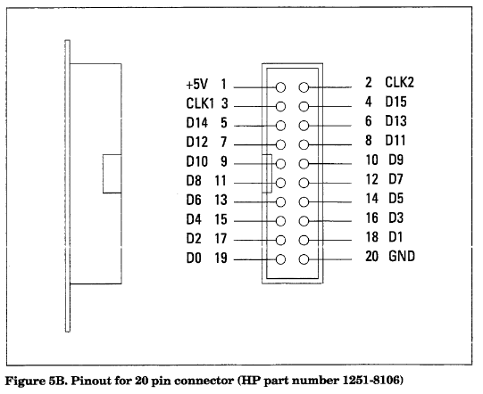

# Termination Adapter for HP Logic Analyzers

The PCB in this repo is a quick and dirty clone of the HP 01650-63203
termination adapter, used for direct connection of a 40-pin pod cable to a
dedicated test port, providing a passive termination network to minimise loading
on the device under test. By adding a cheap set of hookup leads and
minigrabbers, it can also serve as a DIY replacement for the probe pods that are
so frequently missing from analzyers that crop up on the used market.

## Termination network

Per HP application note [AP1244 "Minimizing Intrusion Effects when Probing with
a Logic Analyzer"](docs/5962-8620E_AP1244-1_Minimizing_Intrusion_Effects_When_Probing_With_a_Logic_Analyzer_Jul95),
each probe must be terminated with a series RC network as below (from Figure 1):

HP sold arrays of this termination network (1810-1278 for 9 networks in a DIP
package, 1810-1588 for 5 networks in a SIP package). Naturally these are either
NLA or not available for purchase by mere mortals, but it's easy enough to
implement it in discrete components.

## Pinouts

 

## Power

The logic analyzer supplies +5V at 600mA to each pod connector on pins 1 and 39
of the 40-pin connector. The 01650-63203 termination adatper brings this supply
out to pin 1 of the 20-pin connector. Per HP's documentation, this is intended
solely for powering active probe hardware, and must be a no-connect on the
device under test.

For safety, on this adapter, the +5V supply is broken by a solder jumper that
must be closed in order to supply +5V to the 20 pin connector.

## BOM and assembly

Each adapter requires the following

| Quantity     | Component                                                   |
|--------------|-------------------------------------------------------------|
| 18           | Capacitor, 8pF, 0402 footprint                              |
| 18           | Resistor, 250 ohm 1%, 0402 footprint                        |
| 18           | Resistor, 90.9K 1%, 0402 footprint                          |
| 1            | Keyed 0.1" PCB header, 2x20 pin, right angle                |
| 1            | Keyed 0.1" PCB header, 2x10 pin, vertical                   |
| 1 (optional) | 20 pin IDC ribbon cable, length to taste, female connectors |

Conveniently, JLCPCB's minimum order quantity of 5 is exactly the number of pods
required for my 1652B analyzer. I ordered a set of 5 boards with SMD components
preassembled for approximately 25 USD.

The original 01650-63203 adapters had an exposed section of flexible PCB,
terminated in a 20 pin IDC receptacle, designed to directly connect to a
board-mounted header on the DUT. This adapter substitutes this with a header - a
short length of ribbon cable can be used to connect to the DUT, or standard
Dupont leads can be connected to the pins for individual probes.

## (Lack of) Warranty

This project is presented on an as-is, 'works for me' basis. You are welcome to
build it, use it, adapt it to your own purposes, but all at your own risk.
